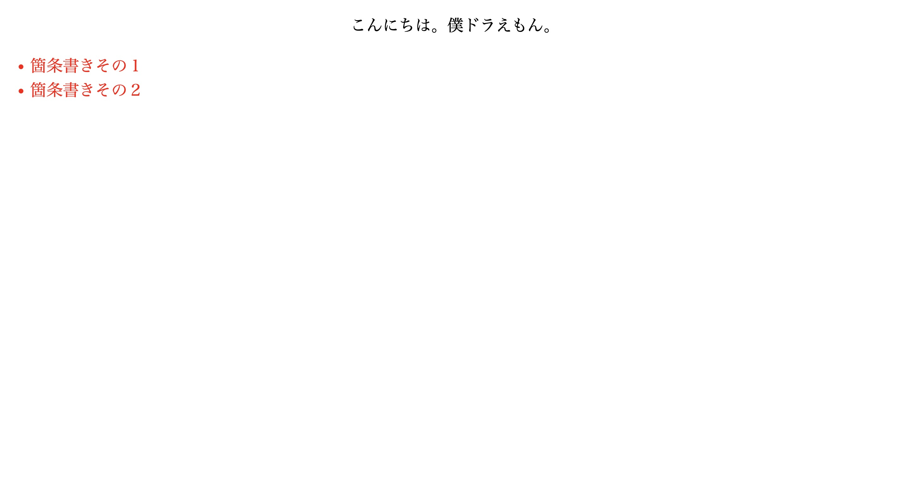
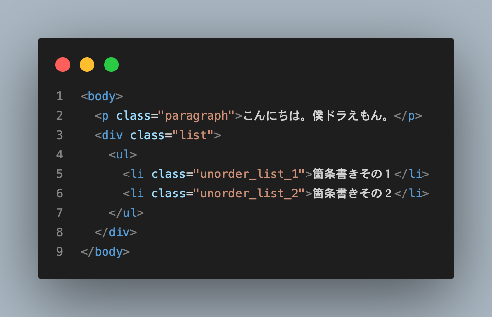
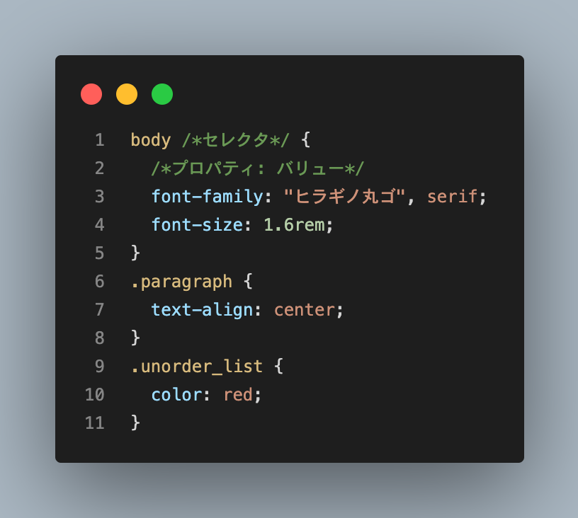
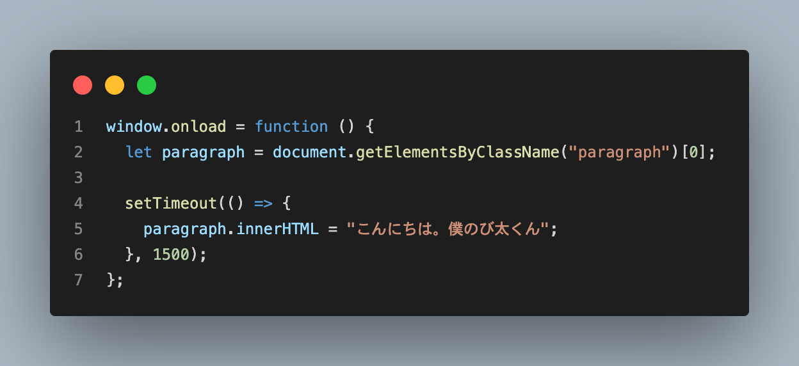
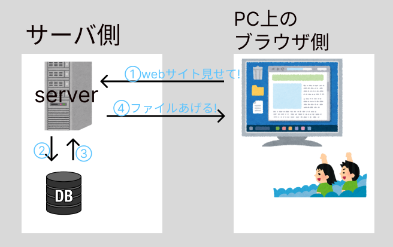
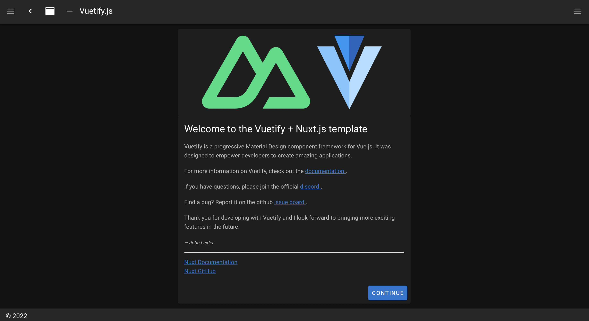

# Web サイトの作り方を調べてみた

LT 会のサンプル
written by tomoyahiroe

---

## お題目

0. 自己紹介
1. はじめに
2. 静的な WEB ページの作成
3. リッチな WEB ページの作成
4. HTML ファイルの自動生成
5. Node.js について
6. WEB 開発フレームワーク
7. まとめ
8. 今後の課題
9. 参考文献

---

## 0. 自己紹介

- 横国経済 2 年、廣江友哉(ひろえ ともや)
- 趣味はソフテニ、ベース
- TypeScript を学習中。
  

---

## 1. はじめに

- このスライドは横浜国立大学公認サークル Lumos が、常盤祭で開催する Lumos Lightening Talks に先んじて LT の例として用意したものです。
- 内容は初学者の方が爆速で JS フレームワークを触れるように前提知識を補強するものとなっています。
- このスライドの内容には誤りが多々含まれているかもしれません。Lumos の見解ではなく、あくまで一個人の解釈だとご認識ください。ご指摘いただければ改善する予定です。ぜひ pull request ください。他人からプルリクくるのが僕の小さな夢の一つです。待ってます。

---

## 2. 静的な WEB ページの作成

- 全ての web サイトは、文章を記述する **HTML** 言語と、それを装飾する **CSS** 言語によってつくられます。

### 例

---

### HTML のコード例

---

### CSS のコード例

---

### 例

---

## 3. リッチな WEB ページの作成

ただ、HTML と CSS のみで作成できる web サイトは動きが乏しく、見応えのあるサイトを作成するのは困難です。(CSS でやれないこともないですが面倒ですし、より技術力が必要になります。)

---

### JavaScript によるページ要素の操作

そこで、**JavaScript** と呼ばれる言語を使用します。JavaScrpt は、HTML(とそれを装飾する CSS)の要素を操作することで、アニメーション豊かな、いわゆるリッチなサイトを作成することができます。

---

- 上のコードの例
  
  

---

## 4. HTML ファイルの自動生成(動的な WEB サイトの作成)

---

- では、ブログサイトなど日々サイトのページ数が増えていくような WEB サイトを作るとき、いちいち HTML ファイルを記述しなければいけないのでしょうか？
- ここで登場するのが、プログラミング言語を使った **HTML ファイルの動的な生成**です。使用できる言語はさまざまで、Python, Ruby, PHP, JavaScript(Node.js)などがあります。
- 本 LT では、特に **Node.js** と **JS フレームワーク**について取り扱います。

---

### どうやって生成するのか

- いくつかの方法はありますが、ほぼ共通しているのは私たちのブラウザ側(Google Chrome, Firefox 等)ではなく、**サーバ**(世界のどこかにあるでかい PC みたいなもん)側で何かしらの処理が動くことです。
- 例えば、ブログサイトだったら１つの記事のタイトルや本文のデータをデータベース(その名の通り必要な情報群)から取ってきて、サーバで HTML ファイルにそのデータをぶち込み通信します。その HTML をブラウザが受け取って私たちはサイトを見ているわけです。
- この例で言うところの、データを取ってきて HTML ファイルにデータをぶち込む作業を前ページに登場した各々の言語が行います。

---

- 超超超ざっくりとしたイメージ
  

---

## 5. Node.js について

---

### JavaScript はサーバで動かない!?

- 実のところ、JavaScript は Chrome や Firefox といったブラウザで実行することのできる言語で、私たちの手元にある PC 上では動作しない言語です。これは、サーバでも同じことが言えます。
- サーバとは常に動いている PC のようなもので、サーバ上でも本来 JavaScript は動作しません。これはつまり、JavaScript ではサーバ上でデータを HTML ファイルにぶち込む作業などができないことを意味します。
- この問題を解決するのが、**Node.js** です。

---

### Node.js とは??

- Node.js とは、本来 JavaScript が動作しない、PC 上で JavaScript のプログラムを実行するための**実行環境**です。
- 実行環境ってなんぞや？とよくわからないかもしれませんが、Node.js の公式サイトからダウンロードすれば誰の PC にだって JS の実行環境(つまり Node.js)ができます。
- 英語を覚えたら、英語の命令を理解して行動できるのと同じように、PC に Node.js をインストールすると、PC は JavaScript を理解して命令を実行できるようになります。つまり、サーバに Node.js をインストールすれば良いわけです。
- Node.js のおかげで、JavaScript はサーバ上でさまざまな処理を走らせることができます。

---

## 6. WEB 開発フレームワーク

動的ページの生成や状態管理など、素の言語だと面倒な処理を簡単にしてくれる便利なテンプレートフォルダのようなもの。これ以降の説明は私の知識不足と記述の簡単化のためより雑な説明となります。ご容赦を。

---

### JS 以外のフレームワーク

WEB 開発のためのフレームワークはいろいろな種類があり、言語ごとに複数個有名なフレームワークがあります。ここではその一例を取り上げます。

- Python
  - **Django**
  - **Flusk**
- PHP
  - **Laravel**
- Ruby
  - **Ruby on rails**

---

### ナウイ JS フレームワーク(フロントエンドフレームワーク)

- **Vue.js**
  - Vue.js をより便利にした **Nuxt.js** がある。
- **React.js**
  - React.js をより便利にした **Next.js** がある。
- **Gatsby.js**
  - React.js ベースのフレームワークらしい。(SSG 専門らしい??)

---

- 例えば、Nuxt.js を使うと、`create nuxt-app [your project name]` と打つだけでこんなフォルダが生成されます。
  

---

- サイトを立ち上げると、すでに...
  

---

## 7. まとめ

- WEB サイトを作る方法はたくさんある。
- それぞれ違ったメリットがあり、サイトの目的や必要な機能によって使用する技術も変わってくると思う。
- ググれば意外と情報が出てくる。ただ、ブラウザで開くタブの量がエグいことになる。

---

## 8. 今後の課題

- SSG, SSR, SPA についても解説できるように理解したい。
- ライブラリーの説明を端折ってしまったのが悔しい。(ライブラリーとフレームワークの違いはよく聞かれるので説明できるようにしたい。)
- JS のパッケージ管理ツールについて時間的に説明できなかった。
- JS フレームワークについてもっと掘り下げたかった。
- テスティングフレームワークについても調べたい。

---

## 9. 参考文献

- JavaScript の歴史(https://www.jetbrains.com/ja-jp/lp/javascript-25/)
- Node.js について(https://qiita.com/non_cal/items/a8fee0b7ad96e67713eb)
- WEB フレームワーク(https://kaopiz.com/ja-news-best-10-web-framework-2020/)
