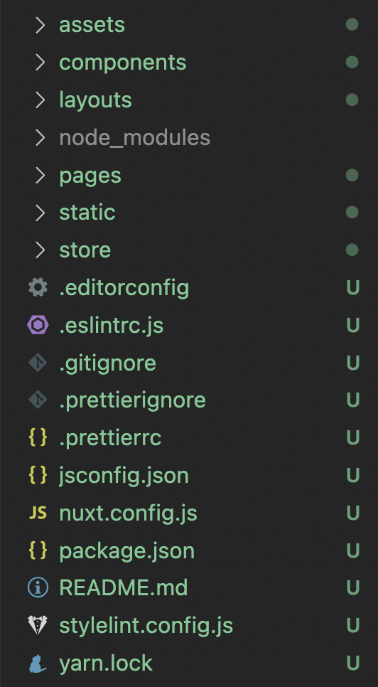
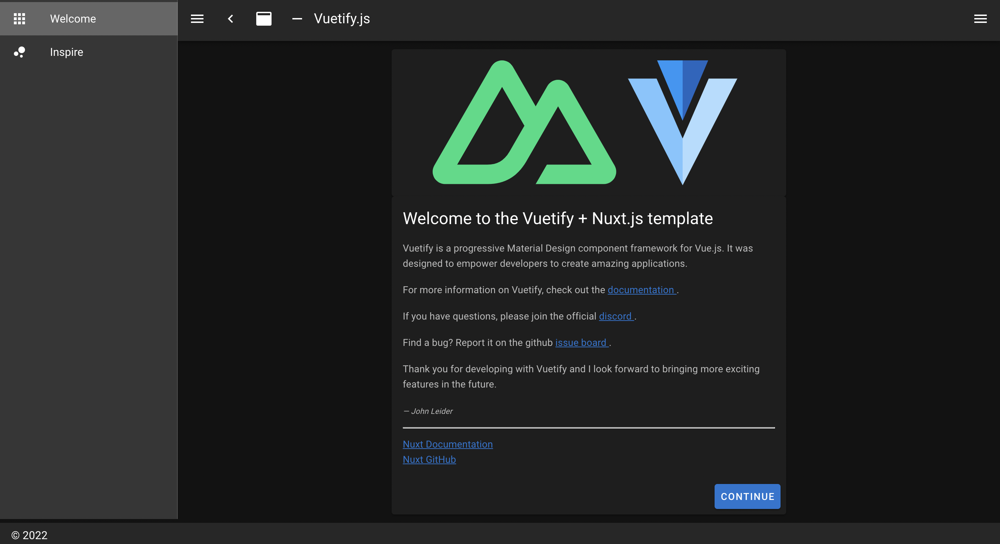
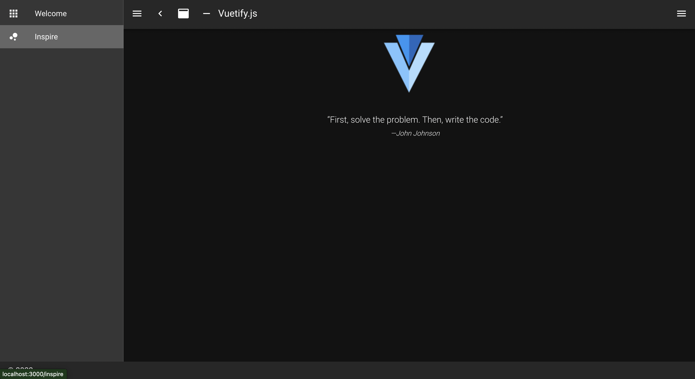

<style>
section {
    background-color: #030303;
    color: #FFF;
    padding-left: 150px; 
    padding-right: 150px;
}
h1 {
    color: #00ff00
}
h2 {
    color: #00ff00

}
pre {
    background-color: #bfbfbf;
    color: #00bb85;
}
</style>

# メモ

- CMS/ headlessCMS
- バックエンド/フロントエンド
- データベース、サーバ
- NodeJS の説明消す？
- web フレームワークの説明を増やしたい
- HTML/CSS の説明を飛ばす
- アイコン画像挿入
- 文章を体言止め箇条書きに直す
- ビジュアルを増やす

---

# Web サイトの作り方を調べてみた

LT 会のサンプル
written by tomoyahiroe

---

## お題目

0. 自己紹介
1. はじめに
2. 静的な WEB ページの作成
3. JavaScript による DOM 操作
4. 静的サイトでできないこと
5. WEB フレームワークとは
6. WEB 開発フレームワーク
7. まとめ
8. 今後の課題
9. 参考文献

---

## 0. 自己紹介

- 横国経済 2 年、廣江友哉(ひろえ ともや)
- 趣味はソフテニ、ベース
- TypeScript を学習中。

  

---

## 1. はじめに

### 目的

- 常盤祭企画 Lumos Lightening talks の発表例を提示すること
- モダンな WEB フレームワーク(特に NuxtJS)に入門するための知識を補強すること

### 想定読者

- HTML/CSS を書いたことがある人

### 注意事項

- 不備は Lumos ではなく tomoyahiroe に帰属
- 親切な方からのご指摘に期待(TwitterID: @yudetamageta)
- 本旨に影響を与えない知識はあえて雑に説明

---

## 2. 静的な WEB ページの作成(素の HTML/CSS)

- あらかじめ用意された HTML と CSS(と JS)を WEB サーバが配信し、私たちの PC 上のブラウザに表示する形式をとるサイト

  - WEB サーバ ... 作成した HTML/CSS ファイルを配信してくれるもの
  - ブラウザ ... ウェブサイトを表示してくれるアプリケーション(Google Chrome,Firefox, Microsoft Edge)

---

## 3. JavaScript による DOM 操作

- DOM ... HTML/CSS の要素のこと(正確には違う)

[DOM の説明記事](https://eng-entrance.com/what-is-dom)

---

### HTML/CSS 要素の操作(DOM 操作)でこんなことができる

- 昔の CSS はそんな機能豊富じゃなかったらしい
  - ダークモード/ライトモードの切り替え
  - 見出しのフェードイン
  - 現在時刻の表示
  - スライダーの表示
  - ハンバーガーメニューの実装

...

---

### JavaScript によるページ要素の操作

- 具体的に JavaScript で書かれるコードの簡易的な例

```js
// 架空JSのコード
button.onclick = function () {
  const defined_name = document.getElementsByClassName(
    "class_name_of_html_element"
  )[0];
  defined_name.innerText = "Lumosに入会する";
};
```

---

## 4. 静的サイトでできないこと

- できないこと
  - HTML ファイルの自動生成
  - ユーザ毎に異なる画面を表示
  - 機能毎にファイルを分けられない
- 死ぬほどめんどくさいこと
  - 画面遷移(リンクの移動)を伴わない画面表示の変更
  - (上の例のように)HTML ファイルに JS で定義した変数の値を埋め込むこと(データバインド)
- 不便なこと
  - 繰り返し使用される表示(ヘッダー/フッター)を HTML ファイル全部に書かなければならない
    などなど。

---

## 5. WEB フレームワークとは？

- プログラムが書かれた沢山のファイル群
- それが動くことで、以下の機能を比較的簡単に実装できる

  - ファイルを機能毎に分割可能(分けたファイルをコンポーネントという)
  - コンポーネントの再利用可能(ヘッダーコンポーネントとか)
  - データに応じて、HTML ファイルを動的に生成(ユーザページ,ブログページ)
  - 画面遷移を伴わない画面表示の変更(SPA の実装)

- つまり、WEB フレームワークを使えば上スライドで挙げた問題を解決できる

---

## 6. WEB フレームワークの種類

---

### JS 以外のフレームワーク

WEB 開発のためのフレームワークはいろいろな種類があり、言語ごとに複数個有名なフレームワークがあります。ここではその一例を取り上げます。

- Python
  - **Django**
  - **Flusk**
- PHP
  - **Laravel**
- Ruby
  - **Ruby on rails**

---

### ナウイ JS フレームワーク

- **Vue.js**
  - Vue.js をより便利にした **Nuxt.js** がある。
- **React.js**
  - React.js をより便利にした **Next.js** がある。
- **Gatsby.js**
  - React.js ベースのフレームワークらしい。(SSG 専門らしい??)

---

## 7. Nuxt.js の例

- Nuxt.js の軽い紹介。

---

- Nuxt.js では、初めにプロジェクトを立ち上げただけで、以下のようにたくさんのフォルダとファイルが作成される
  

---

- サイトを立ち上げると、すでに...
  
  

---

- 具体的な機能や使い方には触れない
- 前回の対面勉強会で Nuxt.js を使った人は、上のスライドで上げた機能を実際に実装してみるのも楽しいかもしれない

---

### 調べてみてほしいキーワード

- さわり始める分には知らなくても大丈夫。
- さわりながら疑問に感じた時に調べて理解すればよし

  - ライブラリー, パッケージ, モジュール
  - パッケージ管理ツール, npm, yarn
  - SPA, SSR, SSG
  - CMS, HeadlessCMS
  - Jamstack

  などなど。

---

## 8. まとめ

- WEB フレームワークは、HTML や CSS, 素の JS による DOM 操作ではできなかったり、難しかったりすることを比較的簡単に実装できるようにしてくれる。
- 今回説明を省いたことが沢山あり、また機会があればまとめてみたい。

---

## 9. 参考文献

- JavaScript の歴史(https://www.jetbrains.com/ja-jp/lp/javascript-25/)
- Node.js について(https://qiita.com/non_cal/items/a8fee0b7ad96e67713eb)
- WEB フレームワーク(https://kaopiz.com/ja-news-best-10-web-framework-2020/)
