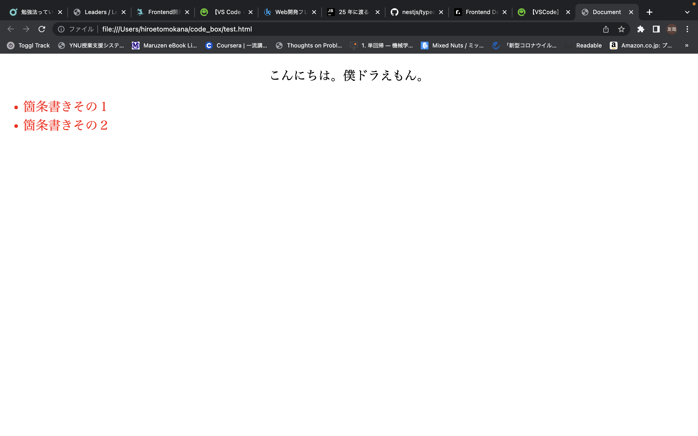
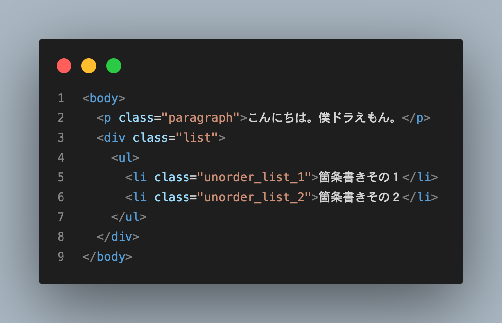
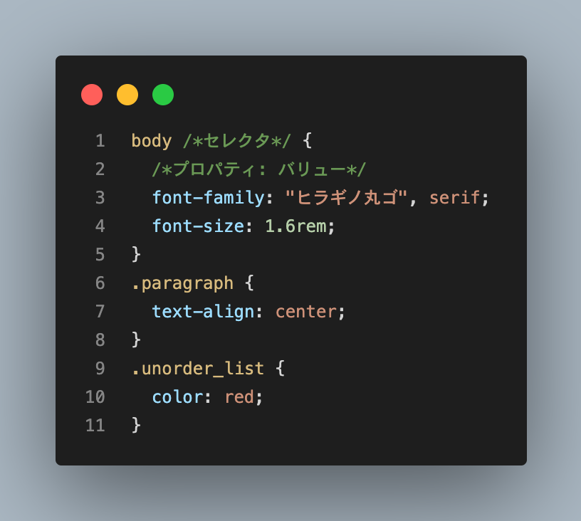
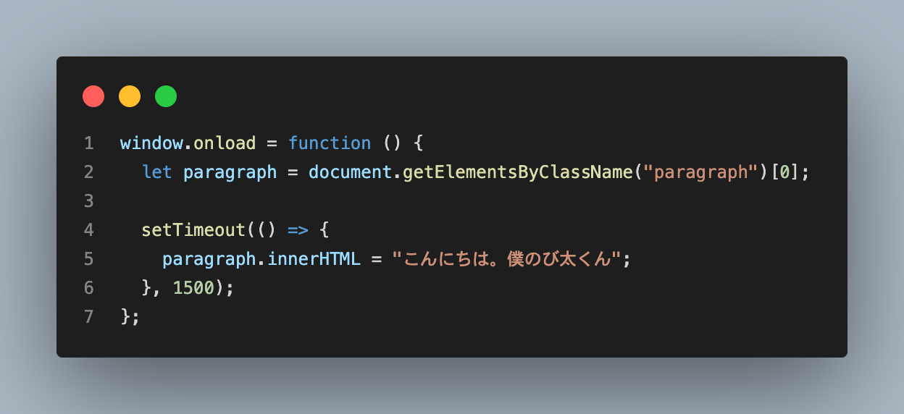
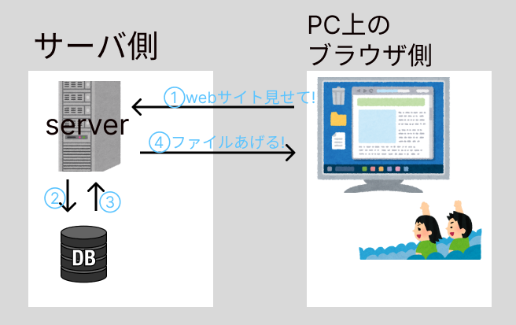

# Web サイトの作り方を調べてみた

---

## memo(雨燦々 MV 公開中)

- HTML / CSS(静的な web ページ)
- アニメーションライブラリーとしての JS
- 動的なページの生成
- Node.js
- JS フレームワークたち(Vue.js React.js Angular backbone etc)

---

## 静的な WEB ページの作成

全ての web サイトは、文章を記述する HTML 言語と、それを装飾する CSS 言語によってつくられます。

# 例

---

### HTML のコード例

---

### CSS のコード例

---

# 例

---

## リッチな WEB ページの作成(JS のアニメーションライブラリー)

ただ、HTML と CSS のみで作成できる web サイトは動きが乏しく、見応えのあるサイトを作成するのは困難です。(CSS でやれないこともないですが面倒ですし、より技術力が必要になります。)

---

### JavaScript によるページ要素の操作

そこで、JavaScript と呼ばれる言語を使用します。JavaScrpt は、HTML(とそれを装飾する CSS)の要素を操作することで、アニメーション豊かな、いわゆるリッチなサイトを作成することができます。

---

- 上のコードの例
  
  

---

## HTML ファイルの自動生成(動的な WEB サイトの作成)

- では、ブログサイトなど日々サイトのページ数が増えていくような WEB サイトを作るとき、いちいち HTML ファイルを記述しなければいけないのでしょうか？
- ここで登場するのが、プログラミング言語を使った HTML ファイルの動的な生成です。使用できる言語はさまざまで、Python, Ruby, PHP, JavaScript(Node.js)などがあります。

---

### どうやって生成するのか

- いくつかの方法はありますが、ほぼ共通しているのは私たちのブラウザ側(Google Chrome, Firefox 等)ではなく、サーバ(世界のどこかにあるでかい PC みたいなもん)側で何かしらの処理が動くことです。
- 例えば、ブログサイトだったら１つの記事のタイトルや本文のデータをデータベース(その名の通り必要な情報群)から取ってきて、サーバで HTML ファイルにそのデータをぶち込み通信します。その HTML をブラウザが受け取って私たちはサイトを見ているわけです。
- この例で言うところの、データを取ってきて HTML ファイルにデータをぶち込む作業を前ページに登場した各々の言語が行います。

---

- イメージ
  

---

## Node.js について

実のところ、JavaScript は Chrome や Firefox といったブラウザで実行することのできる言語ですが、私たちの手元にある PC 上では動作しない言語です。これは、サーバでも同じことが言えます。
サーバとは常に動いている PC のようなもので、サーバ上でも本来 JavaScript は動作しません。

---

## WEB 開発フレームワーク

# フロントエンドフレームワーク(JS フレームワーク)

---

## 参考文献

- JavaScript の歴史(https://www.jetbrains.com/ja-jp/lp/javascript-25/)
- Node.js について(https://qiita.com/non_cal/items/a8fee0b7ad96e67713eb)
- WEB フレームワーク(https://kaopiz.com/ja-news-best-10-web-framework-2020/)
